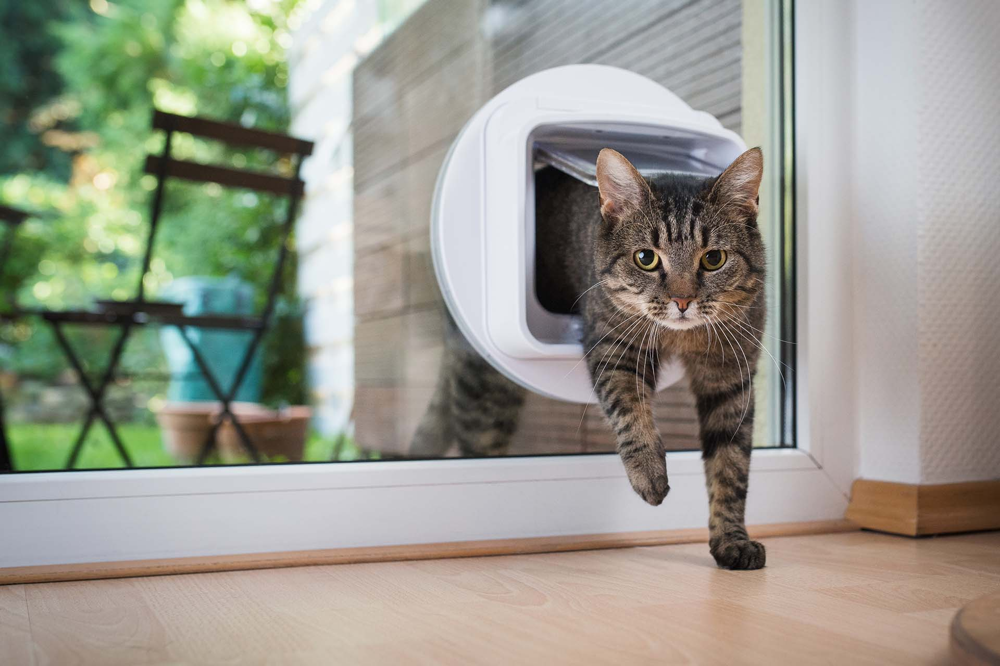

## Who invented the cat flap?

1. [x] Issac Newton, scientist
2. [ ] Philip Kotler, economist
3. [ ] Dragan Botev, carpenter
4. [ ] Albert Einstein, theoretical physicist
5. [ ] Agnes Sheberg, veterinarian
